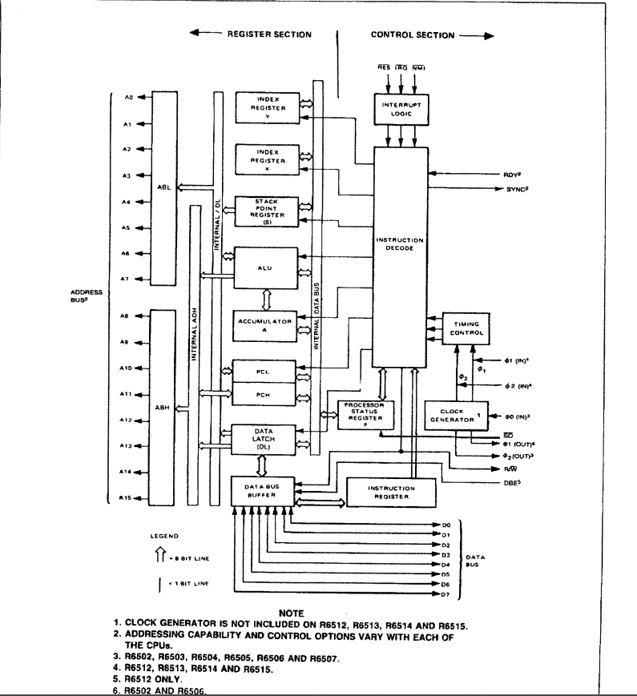
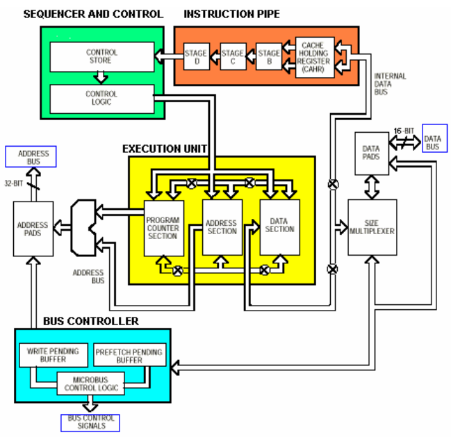

# 197x-8080-processor

## Inspriation
- [Intel 8080][1]
- [Intel 8088][2] ([IBM PC][5])
- [MOS Technology 6502][7] ([Apple II][8])
- [Motorola 68000][4] ([Apple Macintosh][6])

## Application Area
### Intel 8088 - Nathaniel G.
The `Intel 8088` is a general purpose processor, used most notably in the IBM general use PC.
It has an 8-bit external data bus, with a 16-bit registers and one megabyte address range.
### MOS Tech 6502 - Keenan R.
General use. The `MOS Tech 6520` was used in a variety of products such as the original Nintendo Entertainment System to a computer used by the BBC.
### Motorola 68000 - Nate W.
The `Motorola 68000` was one of the first general-purpose processors with a 32-bit instruction set. It was used in the Apple Macintosh for general computing.

## Processor Use
### Intel 8088
Sources for table:
- [cpuworld](http://www.cpu-world.com/Arch/8088.html)
- [stackoverflow](https://stackoverflow.com/questions/9130349/how-many-registers-are-there-in-8086-8088)

| Name | Number | Type | Use |
|------|--------|------|-----|
|AX||Accumulator|Arithmetic, logic, data transfer|
|BX||Base|Can be used as a 16-bit offset address. Paired by default with segment register "DS." (memory ref. [BX] means [DS:BX]|
|CX||Counter|Used to control looping|
|DX||Data|Often used to hold single-byte character data and is referenced as DH or DL. Combines with AX to form a 32-bit register for some operations (e.g. multiply)|
|CS||Code Segment|Holds 
|SI||Source Index|Used for pointer addressing, a source in string instructions, offset address relative to DS|
|DI||Destination Index|Pointer addressing, destination in string processing as ES:DI, offset relative to DS outside of string instructions|
|BP||Base Pointer|Primarily for accessing parameters and locals on the stack|
|SP||Stack Pointer|Points to the top item on the stack, address relative to SS (but not for 16-bit addressing), should point to a word, and an empty stack will have SP = FFFEh|
|CS||Current|Points to current program|
|DS||Definition|Points to variable definitions|
|ES||Extra|User defined usage|
|SS||Stack|points to the stack segment|
|IP||Instruction Pointer|Always points to the next instruction to be executed. Offset relative to CS|
|CF,PF,AF,ZF,SF,TF,IF,DF,OF||Flags Register|Determines the current state of the processor.|


### MOS Tech 6502
| Name | Number | Use |
|------|--------|-----|
|A||Accumulator|
|Y||Index Register|
|X||Index Register|
|PC||Program Counter|
|S||Stack Pointer|
|P||Processor Status Register|

### Motorola 68000
| Name | Number | Use |
|------|--------|-----|
|D0-D7|1-8|Data Registers|
|A0-A6|9-15|Address Registers|
|A7 (USP)|16|Stack Pointer (user)|
|A7' (SSP)|17|Stack Pointer (supervisor)|
|PC|18|Program counter|
|CCR|19|Condition Code Register|


## Processor OPCodes
### Intel 8088
|Instruction|Meaning|Notes|Opcode|
|:---------:|-------|-----|------|
|ADD|add|r/m += r/imm; r += m/imm;|0x00...0x05, 0x80/2...0x83/2|
|AND|logical AND|r/m &= r/imm; r&= m/imm;|0x20...0x25, 0x80/4...0x83/4|
|SUB|subtraction|r/m -= r/imm; r-= m/imm;|0x28...0x2D, 0x80...0x83/5|
|PUSH|Push data onto the stack|*--SP = r/m;|0x06, 0x0E, 0x16, 0x1E, 0x50...0x57, 0x68, 0x6A, 0xFF/6|

### MOS Tech 6502
|Opcode|Operation|Syntax|
|------|---------|------|
|AND| A AND M -> A |And (IND, X) |
|ASL| C <-[76543210]<-0 |ASL A|
|BCC| branch on C = 1| BCC oper|
|DEX|X-1 -> X| DEC|
### Motorola 68000
|Opcode|Operation|Syntax|
|------|---------|------|
|ADD|Source + Destination -> Destination|Add \<ea>,Dn|
|DIVS|Destination/Source -> Destination|DIVS.W\<ea>,Dn|
|EOR|Source OR Destination -> Destination|EOR Dn,\<ea>|
|MOVEA|Source -> Destination|MOVEAE\<ea>,An|

## Block Diagram
### Intel 8088
#### Datapath

#### Memory Types
The 8080 contains `registers` and `data segments`, which are contained in the `Bus Interface Unit,` as well as what looks like a queue to contain the next four instructions in the `Instruction Stream Byte Queue.`
#### How the ALU and Registers Connect
The `ALU` is connected to the registers through the `A-BUS,` which appears to also connect it to the flags and the `Bus Interface Unit.`
#### Instruction Implementation
Instructions seem to be stored in the `Bus Interface Unit,` which includes the `Instruction Pointer.` Then, the instructions are fed into the `ISBQ` via the `C-BUS` before being sent into the `Execution Unit Control System.`
#### Processor Pipeline
It seems like the processor does pipeline instructions by using the `B-BUS` and `C-BUS` to transmit instructions and information through .
#### Clock Speed
The 8088 has a clock speed of `5-10MHz.`
### MOS Tech 6502

### Motorola 68000


#### Memory Types
The 68000 contains 32-bit registers and a 32-bit internal data bus. It also has a non-segmented 24-bit address bus.

#### How the ALU and Registers Connect
The ALU is connected to the registers by the Internal Data Bus.

#### Instruction Implementation
Instructions seem to be stored in the Cache Holding Register, before being fed down the Instruction Pipe to the Sequencer and Control.

#### Processor Pipeline
The processor explicitly pipelines instructions, as outlined in the diagram.

#### Clock Speed
The 68000's clock speed is 4-8 MHz.

## Slightly Esoteric Assembly Language
Just another SEA-language

## General Purpose 16-Bit Processor

```
R-Type
I-Type

SYS
| syscall

MEM
| lw        # Load Word     #
| sw        # Store Word
| li        #
| si        #
| la        #
| sa        #

BRANCH
| bneq      #
| blt       #

JMP
| jump      #
| tjmp      # True Jump
| fjmp      # False Jump

ALU
| add       # Add Register
| addi      # Add Immediate
| sub       #
| subi      #
| mult      #
| multi     #
| div       #
| divi      #
| slt       # Set Less Than
| seq       # Set Equal
| and       # Logical AND
| or        #
| not       #
| xor       #
| slr       #
| srr       #
```

### Registers
| Reg | Hex | Name | Description |
|:----|:----|:-----|-------------|
|R0|0x00|Zero|The value 0|
|R1|0x01|One|The value 1|
|R2-R17|0x02-0x11|A0-A15| General purpose registers|
|R18-R33|0x12-0x21|B0-B15| General purpose registers|
|R34-R49|0x22-0x31|C0-C15| General purpose registers|
|R50|0x16|IP|Instruction Pointer|
|R51|0x17|F|Flag register|

### Flag Register
| Offset | Name | Description |
|--------|------|-------------|
|0x00|Test Result| Result of the most recent comparison|


### Instruction Set
| Instr | Opcode | Description | B1 | B2 | B3 | B4 |
|:-----:|:------:|:------------|:--:|:--:|:--:|:--:|
|COPY |0xFE| Copy r0 -> r1|0xFE|R0|R1|0x00|
|TJMP|0xFD| Jump to LABEL if t0 |0xFD|0x00|ADDR:0|ADDR:1|
|JUMP|0xFC| Jump to LABEL | 0xFC|0x00|ADDR:0|ADDR:1|
|ADD|0x00| [r0 + r1] -> r2|0x00|R0|R1|R2|
|ADDI|0xFF|[r0 + IMM] -> r0|0xFF|R0|IMM:0|IMM:1|
|SLT|0x03| [r0 \< r1] -> t0| 0x03|R0|R1|0x00|
|SEQ|0x02| [r0==r1] -> t0|0x02|R0|R1|0x00|
|AND|0x01| [r0 && r1] - > r2|0x01|R0|R1|R2|


[1]: https://en.wikipedia.org/wiki/Intel_8080
[2]: https://en.wikipedia.org/wiki/Intel_8088
[3]: https://en.wikipedia.org/wiki/Microprocessor#History
[4]: https://en.wikipedia.org/wiki/Motorola_68000
[5]: https://en.wikipedia.org/wiki/IBM_Personal_Computer
[6]: https://en.wikipedia.org/wiki/Macintosh
[7]: https://en.wikipedia.org/wiki/MOS_Technology_6502
[8]: https://en.wikipedia.org/wiki/Apple_II
